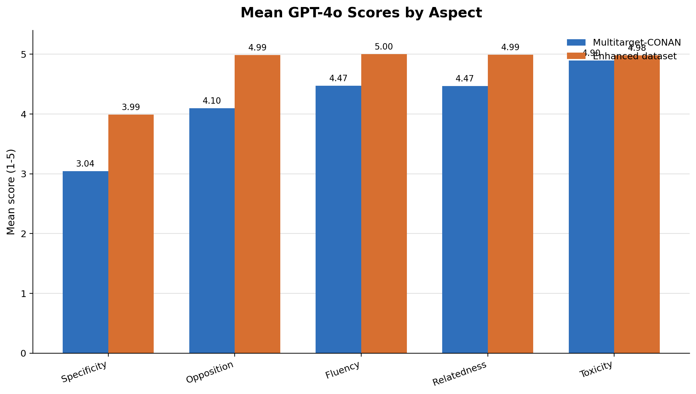
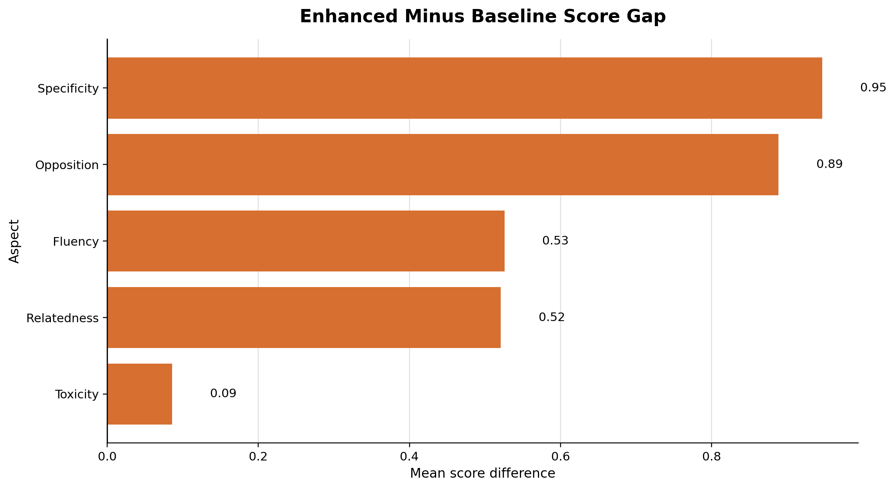
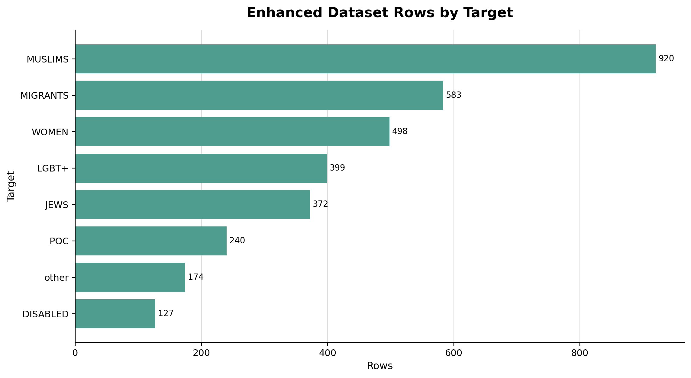

# GPT-4o Counter-Narrative Evaluation Report

## Overview

This report compares counter-narratives from two datasets using the NAACL 2024 LLM-CN-Eval framework:

- **Baseline:** Multitarget-CONAN, using `HATE_SPEECH` and `COUNTER_NARRATIVE`.
- **Enhanced dataset:** generated counter-narratives, using `HATE_SPEECH` and `GENERATED_COUNTER_NARRATIVE`.

The judge model was **GPT-4o**. Each counter-narrative was scored from **1 to 5** on five evaluation aspects.

## Evaluation Aspects

| Aspect | What it measures |
|:--|:--|
| Opposition | Whether the counter-narrative directly opposes or contradicts the hate speech. |
| Relatedness | Whether the counter-narrative is semantically and contextually connected to the hate speech. |
| Specificity | Whether the counter-narrative gives focused, specific arguments against the hate speech. |
| Toxicity | Whether the counter-narrative is respectful and non-toxic. A higher score means less toxic. |
| Fluency | Whether the counter-narrative is clear, grammatical, and well-written. |

## Overall Results

| Aspect | Multitarget-CONAN Mean | Enhanced Dataset Mean | Enhanced - Baseline Gap | Absolute Gap |
|:--|--:|--:|--:|--:|
| Relatedness | 4.469 | 1.931 | -2.538 | 2.538 |
| Opposition | 4.099 | 2.457 | -1.641 | 1.641 |
| Specificity | 3.045 | 1.738 | -1.306 | 1.306 |
| Fluency | 4.474 | 4.431 | -0.043 | 0.043 |
| Toxicity | 4.897 | 4.927 | 0.030 | 0.030 |

## Interpretation

The enhanced dataset performs similarly to the baseline on **fluency** and **toxicity**, meaning the generated counter-narratives are generally readable and non-toxic.

However, the enhanced dataset needs the most improvement in:

1. **Relatedness:** the largest gap. Many generated counter-narratives are not closely connected to the hate speech they are paired with.
2. **Opposition:** generated responses often do not directly challenge or contradict the hateful claim.
3. **Specificity:** generated responses tend to be broad or generic rather than targeted to the specific hateful content.

The core issue appears to be **content alignment**, not surface quality. The generated counter-narratives are fluent and safe, but they often do not respond specifically enough to the given hate speech.

## Enhanced Dataset Per-Target Breakdown

| Target | Row Count | Opposition | Relatedness | Specificity | Toxicity | Fluency |
|:--|--:|--:|--:|--:|--:|--:|
| MUSLIMS | 980 | 2.638 | 2.119 | 1.899 | 4.966 | 4.502 |
| MIGRANTS | 635 | 2.861 | 2.332 | 2.094 | 4.961 | 4.487 |
| WOMEN | 557 | 1.837 | 1.501 | 1.390 | 4.944 | 4.415 |
| LGBT+ | 465 | 2.415 | 1.828 | 1.594 | 4.961 | 4.480 |
| JEWS | 417 | 2.276 | 1.640 | 1.535 | 4.662 | 4.122 |
| POC | 301 | 2.870 | 2.146 | 1.874 | 4.960 | 4.462 |
| other | 179 | 2.659 | 2.078 | 1.838 | 4.972 | 4.408 |
| DISABLED | 175 | 1.583 | 1.229 | 1.194 | 4.966 | 4.451 |

## Areas for Improvement

The enhanced generation pipeline should prioritize:

- Improving **hate-speech-to-counter-narrative alignment**, especially for low-relatedness cases.
- Making the generated response directly address the specific harmful claim.
- Reducing generic counter-speech that is safe and fluent but not tied to the input.
- Auditing low-scoring target groups, especially **DISABLED**, **WOMEN**, and **JEWS**.
- Checking whether some generated counter-narratives are paired with the wrong hate speech row.

## Output Files

The main result files are:

- `results/multitarget_conan_scores.csv`
- `results/enhanced_dataset_scores.csv`
- `results/comparison_summary.csv`
- `results/enhanced_target_breakdown.csv`
- `results/plots/`
